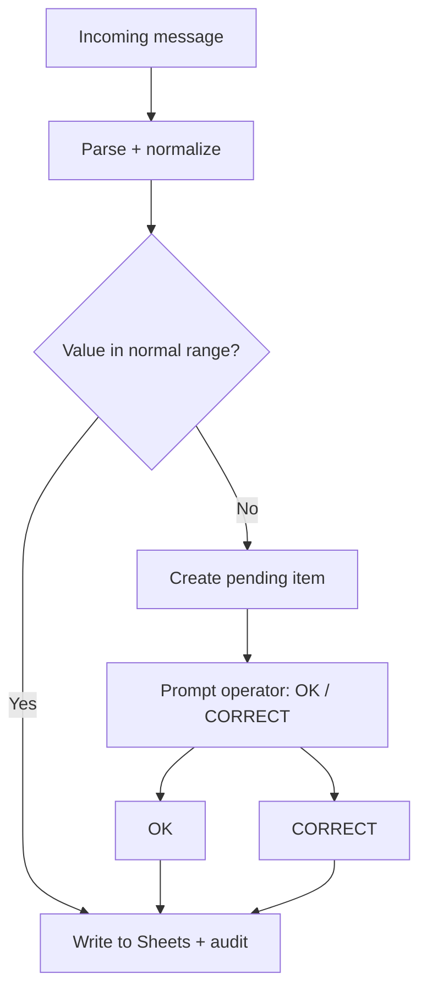

# ClearSun Ops Training Manual (WhatsApp → Google Sheets)

> Purpose: Train a new operator to run the ClearSun daily capture process (hours, loads, diesel, services), understand how the bot interprets messages, and safely correct mistakes.

**Systems covered**
- WhatsApp group operations (human workflow)
- WhatsApp bot (Baileys) → Google Sheets automation
- Dashboard (read-only visibility + operator tools)

**Environments / where things run**
- Bot (PM2): `clearsun-wa` on the server
  - Code (deployed): `/home/ubuntu/clearsun-wa/`
- Dashboard (PM2): `clearsun-dashboard` on the server
  - Code (deployed): `/home/ubuntu/clearsun-dashboard/`
- Source repo (canonical): https://github.com/Highlander89/Clear-Sun-Site (branch `main`)

---

## Quick Start: Day-in-the-Life Checklist (1 page)

### Morning (06:30–08:10 SAST)
1) **Check the dashboard is reachable**
   - Open: `/alerts`
   - Confirm it shows data (not stuck loading).
2) **Confirm the 08:00 Service/Fuel alert was sent**
   - On `/alerts`: check **Last service alert sent** is today.
   - If not sent by ~08:05, use `/operator` → **Send 08:00 alert now**.
3) **Scan for urgent exceptions**
   - Open: `/exceptions`
   - If you see “next due < current hours” / negative hours-to-service: notify supervisor (usually Services sheet needs correction).

### During the day (anytime data comes in)
4) **Post production updates in the WhatsApp group**
   - Prefer one message per shift (or the approved bulk format).
   - If the bot asks to confirm, reply with **OK <id>** or **CORRECT <id> <value>**.
5) **If a bulk closing message fails**
   - The bot will reply with an error.
   - Fix the message format and resend.
   - Do *not* try to “force it”; invalid bulk closes are intentionally blocked from writing to machine tabs.

### End of day (15:00–17:00 SAST)
6) **Sanity-check the numbers landed**
   - Open `/production` and `/fuel`.
   - Spot-check at least 1–2 machines in the Sheet if something looks off.
7) **If you must correct something**
   - Use the dashboard correction endpoint (or supervisor process) so it creates an audit trail.
   - Then confirm the correction reflects in `/audit` (and RawData row appended).

### If something looks wrong (triage)
8) **Use `/audit` to understand what the bot did**
   - Find the message row; see the parsed actions + exact writes.
9) **Use `/operator` tools**
   - Run **Drift-check** if rules vs dashboard seem inconsistent.
   - Run **QA smoke** after changes/restarts.

### Monthly / when the month rolls over
10) **Expect hours/month-total cells to shift**
   - Month boundaries can affect summary cells.
   - If dashboard totals look wrong on the 1st/2nd, escalate (sheet formulas and month rollups are the usual culprit).

---

## 1) Business process (human workflow)

### 1.1 What the operators send daily
Operators post daily production data into the ClearSun WhatsApp group. The bot reads those messages and writes to the Google Sheet.

The daily items are:
- **Hours (closing hours)** per machine
- **Loads** per machine (quarry/screen/tailings)
- **Diesel** (issues per day + diesel dip stock-on-hand)
- **Services** (service counters and due-hours; service alerts are generated daily)

### 1.2 The Google Sheet is the source of truth
The bot writes into an existing operational Google Sheet.

- Sheet ID (live): `1yd_Zd2akUwSNoN0pHH0qLsmAT7Mxg7Nw81qYIulD-W4`
- Each machine has its own tab.
- `Services` tab drives service due calculations.
- `RawData` tab is the audit stream (append-only history).

---

## 2) Message formats the bot accepts (operator-facing)

> The goal is: operators can send quick, unambiguous messages; the bot normalizes and parses them.

### 2.1 Single-line updates
Examples (illustrative):
- Hours: `ADT 001 1234` (closing hours)
- Loads: `ADT 001 Q 12 S 5 T 0`
- Diesel issue: `DIESEL / ADT 001 235L`

### 2.2 Bulk closing message (multi-line)
A “bulk close” is a single WhatsApp message that contains multiple machines and sections.

Key rules:
- Loads are written to **H/J/K** (never column L)
- Hours are written to **D** and the month total cell (E35) is read for dashboard views
- Diesel section accumulates into **F{dayRow}** per machine

The exact parsing rules are documented on the dashboard:
- `/bulk-close-rules`

---

## 3) Safety & data quality rules

### 3.1 Input normalization (what the bot fixes automatically)
- Machine code aliases are normalized to canonical codes (e.g. `ADT 1` → `ADT001`)
- Thousands separators are normalized (`42 500`, `42,500` → `42500`)

### 3.2 Confirmation state machine (out-of-range protection)
Normal values write immediately.

If values are suspicious, the bot asks for confirmation and **does not write** until confirmed.

Confirmed ranges (set by Frederick):
- Fuel price: 10–40
- Diesel dip: 500–200000
- Diesel issue: 5–2000

Operator commands:
- `OK <id>` — approve pending write
- `CORRECT <id> <value>` — override and write corrected value

### 3.3 Invalid bulk close gating
If a bulk close fails validation:
- It is appended to `RawData` **only** (audit)
- The bot replies with an error
- No machine-tab writes occur

---

## 4) Dashboard: what to check daily

### 4.1 Alerts page (`/alerts`)
Shows:
- Service alerts due/near-due
- Last service alert sent timestamp
- Bot health + queue depth
- Idempotency ledger tile (prevents duplicate writes)

### 4.2 Exceptions page (`/exceptions`)
Shows anomalies derived from the `Services` sheet, e.g.:
- Next due < current hours
- Negative hours-to-service

### 4.3 Operator page (`/operator`)
This is the “big buttons” toolbox:
- Send 08:00 alert now
- Restart bot/dashboard
- Run drift-check
- Run QA smoke
- Post templates to WA group

### 4.4 Audit page (`/audit`)
Reads: `/home/ubuntu/clearsun-wa/audit-decisions.jsonl`

This lets an operator see, per message:
- what the bot parsed
- what it decided
- what it wrote

---

## 5) 08:00 SAST Daily Service/Fuel alert

At 08:00 SAST the bot posts a service summary and fuel stock line to the WhatsApp group.

Key point: the service alert is tracked independently from any personal digest.

Manual trigger:
- create file: `/home/ubuntu/clearsun-wa/.send-alert-now`

---

## 6) Audit & traceability

### 6.1 RawData tab (sheet audit)
Every meaningful event should have a RawData entry, especially:
- invalid bulk close attempts
- CORRECT operations

### 6.2 audit-decisions.jsonl (bot decision audit)
A JSONL stream on disk for rapid dashboard display.

Rotation: file rotates at ~20MB.

---

## 7) Business process diagrams (copy-paste into docs)

### 7.1 End-to-end flow

```mermaid
flowchart LR
  WA[WhatsApp Group] --> BOT[clearsun-wa bot]
  BOT -->|parse + normalize| RULES[Business Rules + Confirmation]
  RULES -->|writes| SHEETS[Google Sheets]
  BOT -->|append| AUDIT[RawData + audit-decisions.jsonl]
  DASH[Dashboard] -->|reads| SHEETS
  DASH -->|reads| AUDIT
```

### 7.2 Out-of-range confirmation flow

---

## 8) Where the authoritative rules live (SPEC-FIRST)

**Before any changes** (code or process), read:
- `/home/ubuntu/.openclaw/workspace/docs/specs/clearsun-whatsapp-sheets-business-logic-spec.md`

This manual is an operator view; the spec is the engineering truth.

---

## 9) Appendix: quick commands (engineering only)

- Bot logs: `pm2 logs clearsun-wa`
- Dashboard logs: `pm2 logs clearsun-dashboard`
- Restart bot: `pm2 restart clearsun-wa`
- Restart dashboard: `pm2 restart clearsun-dashboard`
- QA smoke: `bash /home/ubuntu/clearsun-wa/scripts/qa-smoke.sh`
- QA full: `bash /home/ubuntu/clearsun-wa/scripts/qa-full.sh`
